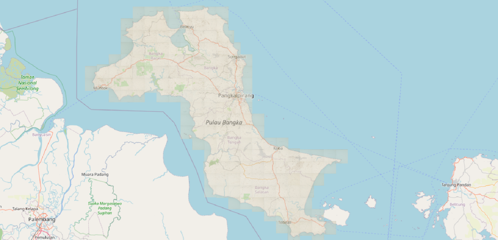
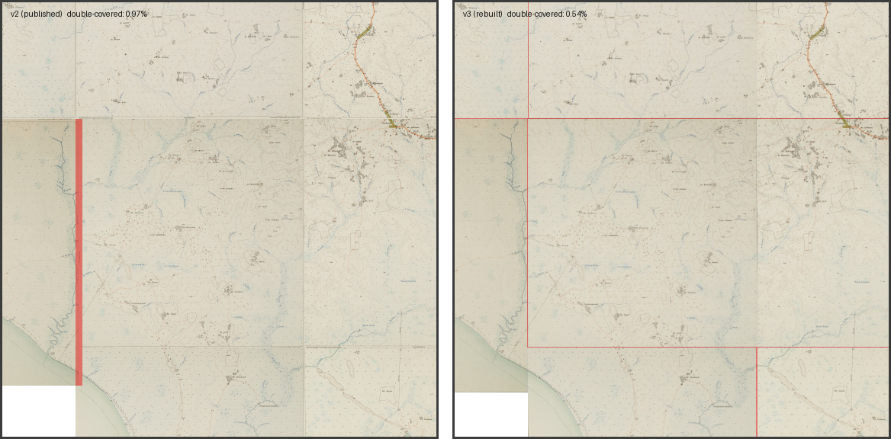
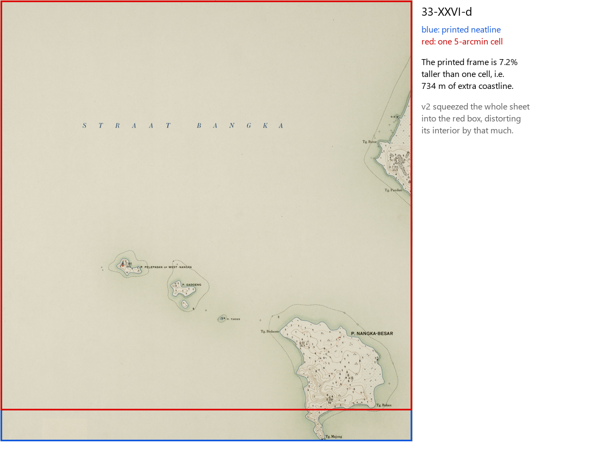

# Bangka Island 1930s Historical Topographic Map Dataset (176 Sheets) & Georeferencing Pipeline


[](https://huggingface.co/datasets/ibrahimatlgn/bangka-1930s-topographic-maps)

This repository georeferences 176 sheets of the **1930s Dutch Colonial
Topographic Map Series of Bangka Island** (`KK 083-04-01/085-04-10`) into
WGS 84 (EPSG:4326) GeoTIFFs, as a ground-truth base layer for deep-learning
analysis of historical land use.

## Status (August 2026)

| | version | rasters | metadata | GeoTIFFs on Hugging Face |
|---|---|---|---|---|
| **current** | v3.1 | `GEOREF_V3_1/` (local, not tracked in git — see below) | `bangka_dataset_v3_1.csv` | [uploaded ✅](https://huggingface.co/datasets/ibrahimatlgn/bangka-1930s-topographic-maps) |
| superseded | v2 | `GEOREF_FINAL_STANDARD_164/`, `GEOREF_FINAL_COMPOSITE_12/` | `bangka_dataset_v2.csv` | still present, for provenance |

**v3.1 supersedes v2.** v2's composite sheets overhung their neighbours by up
to 278 m along a 9.3 km seam (21 overlapping sheet pairs) and two ordinary
single-letter sheets were silently squeezed out of shape. v3 rebuilds every
sheet from the printed neatline instead of the scan edge; v3.1 adds a small,
measured inland correction. Full account of what was wrong and what changed:
**[`V3_REPORT.md`](V3_REPORT.md)**.

Both versions are on Hugging Face — `GEOREF_V3_1/` is the one to use; v2 is
kept alongside it rather than overwritten, so anything that already cites v2
still resolves.



*All 176 sheets in their v3.1 positions, over OpenStreetMap. Muntok,
Belinyu, Sungailiat, Pangkalpinang, Koba and Toboali all fall where the
modern basemap puts them, and the drawn coastline follows the real one.
Basemap © OpenStreetMap contributors (ODbL). This figure is a QGIS export and
ships with a world file (`figures/osm_overlay.pgw`), so it can be loaded back
into a GIS as a georeferenced overview.*

### What was wrong, in one picture



*The same seam in v2 (left) and v3 (right). Red marks where two sheets paint
the same ground. In v2 the composite sheet `35-XXVII-ko` overhangs its
neighbour along the entire 9.3 km boundary, because its width came out
5.03′–5.11′ instead of 5.00′. In v3 that band is gone.*



*`33-XXVI-d` has an ordinary single-letter code, but its printed neatline
(blue) is 7.2 % taller than one 5′ cell (red). v2 squeezed the whole sheet
into the red box; v3 places it at its true size.*

## Quick Start

```python
import sys
sys.path.insert(0, "v3")
import sheet_to_wgs84 as geo

lon, lat = geo.pixel_to_lonlat("34-XXV-e", x=1200, y=850)   # -> WGS 84 coordinate
```

Or in QGIS: build a VRT over `GEOREF_V3_1/*/*.tif` (`gdalbuildvrt`) and add it
as one layer — see [`V3_REPORT.md §6`](V3_REPORT.md) for the full reproduction
steps and other scripts.

## Dataset Composition

- **162 single-cell sheets** — one 5′ × 5′ graticule cell each.
- **12 composite sheets** — printed across two adjacent cells (9 vertical
  5′ × 10′, 3 horizontal 10′ × 5′) to capture coastlines where a full cell
  would be mostly sea.
- **2 irregular sheets** (`33-XXVI-d`, `34-XXVII-g`) — ordinary single-letter
  codes, but printed past their cell like the composites (found during the
  v3 rebuild; see `V3_REPORT.md §1b`).

## Key Results (v3.1, verified — see `V3_REPORT.md` for method and full numbers)

1. **Neatline placement.** Every sheet is placed by its detected printed
   frame, not the scan edge. Max deviation from the exact graticule over 162
   regular sheets: **8.4 m**.
2. **No structural overlaps.** 0 overlapping sheet pairs (v2 had 21, all
   involving composites).
3. **Evidence-based anchoring.** All 14 non-standard sheets (12 composites +
   2 irregular) have their anchor edge confirmed by measurement against OSM
   (shoreline for 10, road network for the other 4) — not assumed.
4. **Inland accuracy.** Measured against the OSM road network (roads move far
   less than the coastline over 90 years): median residual **170 m**, with a
   60-sheet subset converging on a consistent **30 m** median residual after
   applying the v3.1 correction.
5. **Coastal accuracy.** Median shoreline residual **~780 m** — dominated by
   real coastal change since the 1930s (tin dredging, mangrove change), not
   by georeferencing error; see `V3_REPORT.md §3` before citing this figure
   as positional accuracy.

## Data Provenance & Source

The 176 map sheets are digitized scans from the map series
**"Res. Bangka en Onderhoorigheden"** (topografische en fotogrammetrische
kaartering), scale 1:25,000, produced by the **Topografische Dienst in
Nederlandsch-Indië** (Topographic Service of the Netherlands East Indies),
Batavia. Survey/publication: 1930–1936 (e.g. sheet *Blad 31/XXIV q*, surveyed 1932).

### Source & persistent identifier
Digitized and held by **Leiden University Libraries – Digital Collections**
(Dutch Colonial Maps / KIT collection).

- Shelfmark: `KK 083-04-01/085-04-10`
- Persistent URL (whole series): http://hdl.handle.net/1887.1/item:2078333

### Rights / license of source maps
The rights status of the source material is **public domain**
(Creative Commons Public Domain Mark 1.0), as declared by the holding
institution. Citing Leiden University Libraries as the source is requested.

### Dataset metadata provenance & contribution
`bangka_dataset.csv` (the original sheet index / metadata table) was **not
compiled by the repository owner**. It was provided as source material by
Thomas Smits (supervisor); the original compiler of the underlying table is
not documented beyond this. Thomas Smits also supplied the neatline-accurate
crops (August 2026) that the v3 rebuild is built from. The georeferencing
pipeline and the accuracy metrics reported here are the owner's own work.

## Repository Structure / Klasör Yapısı

```text
bangka-historical-gis/
├── README.md                      # This file
├── V3_REPORT.md                   # Current methodology, findings, accuracy (READ THIS FIRST)
├── CHANGELOG.md                   # v1 → v2 → v3/v3.1 change history
├── bangka_dataset_v3_1.csv        # Current metadata (176 sheets) — use this
├── bangka_dataset_v3.csv          # v3.0 metadata (no inland correction)
├── bangka_sheet_quality.csv       # Per-sheet positional confidence + land area
├── environment.yml                # Conda environment (recommended install)
├── .gitignore
│
├── v3/                             # Current pipeline — see V3_REPORT.md §6 to run it
│   ├── grid.py                    #   sheet geometry: crop pixels -> WGS 84
│   ├── scan_frames.py             #   detect the printed neatline on every sheet
│   ├── fit_irregular.py           #   decide composite/irregular anchors vs OSM shoreline
│   ├── fit_irregular_roads.py     #   same, vs OSM roads, for sheets the shoreline can't decide
│   ├── georeference.py            #   write the 176 GeoTIFFs
│   ├── sheet_to_wgs84.py          #   pixel -> lon/lat helper for downstream pipelines
│   ├── sheet_quality.py           #   builds bangka_sheet_quality.csv
│   └── ...                        #   verification / accuracy-measurement scripts
│
├── figures/                       # Figures used above — regenerate with v3/make_figures.py
│
├── qgis/                          # Portable QGIS layers (vector; .vrt rasters are local-only)
│   ├── sheet_index_v3.geojson     #   every sheet's printed-frame footprint + attributes
│   └── graticule_5min.geojson     #   the theoretical 5' cell grid
│
├── Superseded (v2) — kept for provenance, see the notice at the top of each:
│   ├── METHODOLOGY_REVISED_EN.md  #   v2 methodology write-up
│   ├── bangka_technical_report.md #   v2 technical report
│   ├── bangka_dataset_v2.csv      #   v2 metadata
│   ├── map_crop.py, automated_georef.py, recalc_margins.py, crop_margin_geo.py
│   ├── verify_georef.py, osm_alignment_check.py, calibration_comparison.py
│   └── archive/                   #   experimental scripts + the original source CSV
│
└── (not tracked in git — see .gitignore) new_crops/, GEOREF_V3_1/, GEOREF_V3/,
    GEOREF_FINAL_STANDARD_164/, GEOREF_FINAL_COMPOSITE_12/, main maps/, recovered_maps/
```

## Downloading the Full Map Dataset (GeoTIFFs)

Due to GitHub size limits, the georeferenced GeoTIFF archives and raw scans
are not tracked in this Git repository.

**📦 https://huggingface.co/datasets/ibrahimatlgn/bangka-1930s-topographic-maps**
— both v3.1 (current) and v2 (superseded) are hosted there, side by side.

```python
from huggingface_hub import snapshot_download
snapshot_download(
    repo_id="ibrahimatlgn/bangka-1930s-topographic-maps",
    repo_type="dataset",
    local_dir="bangka_data",
    allow_patterns=["GEOREF_V3_1/*", "bangka_dataset_v3_1.csv",
                    "bangka_sheet_quality.csv"],   # v3.1 only; omit for everything
)
```

Also on Hugging Face: `new_crops/` (the neatline-accurate source crops the v3
pipeline reads) — needed only to *reproduce* the georeferencing, not to use
the finished rasters.

## Using the Data (Quick Start)

The rasters are plain **GeoTIFF** in **WGS 84 (EPSG:4326)** — no special
tooling needed, any GIS reads them directly. Each carries an internal mask
that hides the paper outside the printed neatline, so sheets mosaic without
double coverage.

1. **Get the rasters** — v3.1 preferred (see above).
2. **Open them in QGIS:** `Layer → Add Layer → Add Raster Layer…`, multi-select
   the `.tif` files, or build a single VRT with `gdalbuildvrt` over the whole
   folder for one merged layer (recommended — 176 individual layers is slow).
3. **Add a basemap for context** (optional): `XYZ Tiles → OpenStreetMap`.
4. **Composites and irregular sheets** place correctly against their
   neighbours without any special handling — the anchor logic is baked into
   the GeoTIFF's geographic extent.
5. **Converting detection pixel coordinates to WGS 84** (e.g. from a YOLO
   pipeline run on the crops): use `v3/sheet_to_wgs84.py`, which also handles
   the old-crop → new-crop pixel shift if your coordinates were measured on
   the v2 crops.

## Requirements & Installation

Only needed to **reproduce** the pipeline (not to view the data).

**Recommended — conda** (installing GDAL via pip is unreliable):

```bash
conda env create -f environment.yml
conda activate bangka-gis
```

```bash
# v3.1 pipeline (current) — run from the repository root, in order.
# Expects the neatline-accurate crops in new_crops/map/*.jpg.
python v3/scan_frames.py       # 1. measure every printed neatline -> v3/frames.csv
python v3/build_masks.py       # 2. cache sea masks / shorelines   -> v3/masks/
python v3/fit_irregular.py     # 3. decide composite/irregular anchors vs OSM shoreline
python v3/fit_irregular_roads.py  # 4. same, vs OSM roads, for the sheets §3 couldn't decide
python v3/georeference.py      # 5. write the 176 GeoTIFFs          -> GEOREF_V3_1/
python v3/build_metadata.py    # 6. metadata                        -> bangka_dataset_v3_1.csv
python v3/sheet_quality.py     # 7. per-sheet quality table          -> bangka_sheet_quality.csv
```

The superseded v2 pipeline (`map_crop.py` → `recalc_margins.py` →
`automated_georef.py` → `crop_margin_geo.py`) still runs but is not
recommended; see the notice at the top of `METHODOLOGY_REVISED_EN.md`.

## Known Limitations

- 4 of the 14 non-standard sheets' anchors were confirmed via the OSM road
  network rather than the (unavailable) shoreline; see `V3_REPORT.md §2` for
  which ones and the margin of evidence.
- Coastal accuracy cannot be measured below ~780 m by comparison with modern
  imagery, because the coastline itself has moved that much since the 1930s.
  Inland accuracy (roads, buildings) is the better proxy and is measured
  separately — see `V3_REPORT.md §3`.
